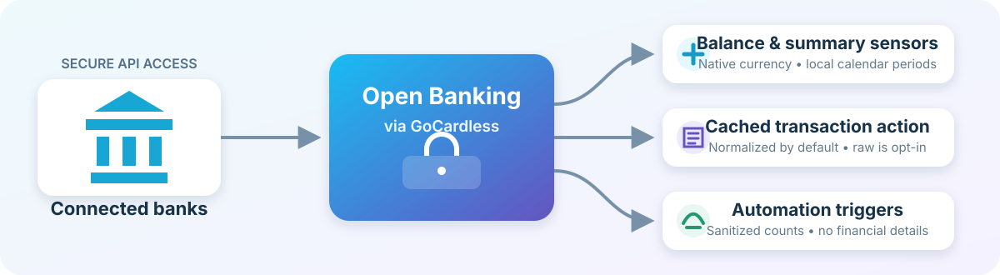

<div align="center">
  <picture>
    <source media="(prefers-color-scheme: dark)" srcset="custom_components/open_banking/brand/dark_icon.png">
    <source media="(prefers-color-scheme: light)" srcset="custom_components/open_banking/brand/icon.png">
    
  </picture>

# Open Banking via GoCardless for Home Assistant

[](https://github.com/megageek/open-banking-homeassistant/releases/latest)
[](https://github.com/megageek/open-banking-homeassistant/actions/workflows/validate.yml)
[](https://www.home-assistant.io/)
[](https://hacs.xyz/)
[](LICENSE)

Balances, transaction summaries, and privacy-conscious automation triggers in Home Assistant.

</div>

A Home Assistant custom integration for account balances and transactions from the
[GoCardless Bank Account Data API](https://developer.gocardless.com/bank-account-data/overview).

This is an independent, community-developed integration and is not affiliated
with or endorsed by GoCardless. GoCardless is a trademark of GoCardless Ltd.

> [!CAUTION]
> **An existing GoCardless Bank Account Data account is required.** GoCardless
> no longer accepts new registrations for this service. If you did not create a
> Bank Account Data account before registrations closed, this integration will
> not work for you. Existing account holders can continue to sign in and create
> new API user secrets.

> [!IMPORTANT]
> **European availability only.** This integration works only with banks in the
> supported European countries offered by GoCardless Bank Account Data. It does
> not support banks in the United States or other regions, and coverage is not
> available in every European country.

> [!WARNING]
> Version 0.6.0 changes the integration domain from `nordigen` to `open_banking`.
> Remove the old integration and YAML configuration before installing this release.

## User documentation

- [Getting started](docs/user/GETTING_STARTED.md) — installation, requirements,
  and initial bank authorization
- [Configuration guide](docs/user/CONFIGURATION.md) — refresh scheduling,
  balance types, transaction storage, privacy, and reconnection
- [Examples](docs/user/EXAMPLES.md) — balance templates, transaction retrieval,
  and automation triggers

## Features

- UI configuration with GoCardless user secrets
- Multiple bank connections under one GoCardless account
- Browser-based bank authorization with an automatic Home Assistant callback
- Monetary balance sensors using each account's native currency
- Diagnostic connection-status, last-refresh, and next-refresh sensors
- Configurable daily refresh count and active refresh window
- Optional 90-day transaction caching in memory or encrypted persistent storage
- Seven per-account spending, income, and pending-transaction summary sensors
- A response-only action for retrieving normalized cached transactions
- Sanitized transaction-update event entities and native automation triggers



## Requirements

- Home Assistant 2026.4 or newer
- HACS 2.0.5 or newer when installing through HACS
- An existing GoCardless Bank Account Data account and API user secrets; new
  service registrations are no longer available
- A bank in one of the supported European countries shown during setup
- A working external Home Assistant URL for the bank authorization callback

## Installation

### HACS

1. Add `megageek/open-banking-homeassistant` as a custom integration repository.
2. Install **Open Banking via GoCardless**.
3. Restart Home Assistant.

### Manual

Copy `custom_components/open_banking` into your Home Assistant
`custom_components` directory, then restart Home Assistant.

## Configuration

Before adding the integration, sign in to your existing
[GoCardless Bank Account Data account](https://auth0.gocardless.com/login).
New Bank Account Data accounts can no longer be registered. After signing in,
open the [**User Secrets** page](https://bankaccountdata.gocardless.com/user-secrets/),
create a new secret pair, and securely copy both the **Secret ID** and **Secret
key**. These are API credentials, not your bank login details. Do not publish or
share them.

1. In Home Assistant, open **Settings → Devices & services → Add integration**.
2. Select **Open Banking via GoCardless**.
3. Enter the secret ID and secret key from GoCardless Bank Account Data.
4. Select a country and institution.
5. Choose whether transaction support is disabled, held in memory, or persisted
   in encrypted form.
6. Complete authorization on the bank's website. The browser returns to Home
   Assistant and completes the connection automatically.

Additional institutions can be added as bank connections beneath the same
GoCardless account entry. By default, each connection refreshes four times per
day between 07:00 and 22:00 local time. Refreshes are distributed evenly across
that window and automatically respect any stricter rate limit reported by the
bank.

The account-holder label is a Home Assistant display label that helps identify
the person or profile connected to a bank; it is not sent to the bank as an
account-holder name. Selected balance types determine which balance sensors
Home Assistant creates when the bank returns those types.

Transaction support is disabled by default. When enabled, transactions are
retrieved on the same schedule as balances and retained for up to 90 days, with
a maximum of 5,000 records per account. Memory mode loses its raw cache when
Home Assistant restarts. Encrypted persistent mode restores the cache after a
restart. See the [configuration guide](docs/user/CONFIGURATION.md#transactions)
for the privacy and encryption limitations.

The `open_banking.get_transactions` action returns cached data and never makes
an extra bank request. By default it returns normalized fields only; raw,
bank-specific payloads must be requested explicitly. Transaction event entities
and native automation triggers expose timestamps and aggregate change counts,
not financial details. See the [examples](docs/user/EXAMPLES.md) for action and
automation usage.

## Upgrading from `nordigen`

The domain change cannot be migrated automatically by Home Assistant:

1. Remove the old Nordigen integration and its YAML configuration.
2. Remove any remaining `custom_components/nordigen` directory.
3. Install version 0.6.0 and restart Home Assistant.
4. Add **Open Banking via GoCardless** through the UI and reconnect each bank.
5. Update automations and dashboards to use the newly created entity IDs.

## Development

Open the repository in its DevContainer, then use:

```bash
script/check
script/test
script/hassfest
script/develop
```

See [CONTRIBUTING.md](CONTRIBUTING.md) and the documentation under
[`docs/development`](docs/development/) for the complete workflow.

## Security and privacy

API secrets are stored in the Home Assistant config entry. Diagnostics redact
secrets, account-holder labels, requisition IDs, account identifiers, IBANs,
BBANs, account owner data, and transaction contents.

Encrypted persistent transaction caches use application-level AES-GCM
encryption. This protects a cache file viewed in isolation, but it does not
protect against compromise of the complete Home Assistant configuration because
that configuration also contains the credential used to derive the encryption
key. Recorder may retain summary sensor states, and automation or script traces
may retain action responses in both enabled storage modes.

## Current scope

The integration provides balances, cached transaction history, transaction
summaries, and sanitized transaction-update triggers. It does not currently
provide transaction categorization, budgets, long-term financial analytics, or
automatic export. Bank capabilities, transaction fields, consent duration, and
API quotas vary by institution.

## License

MIT
